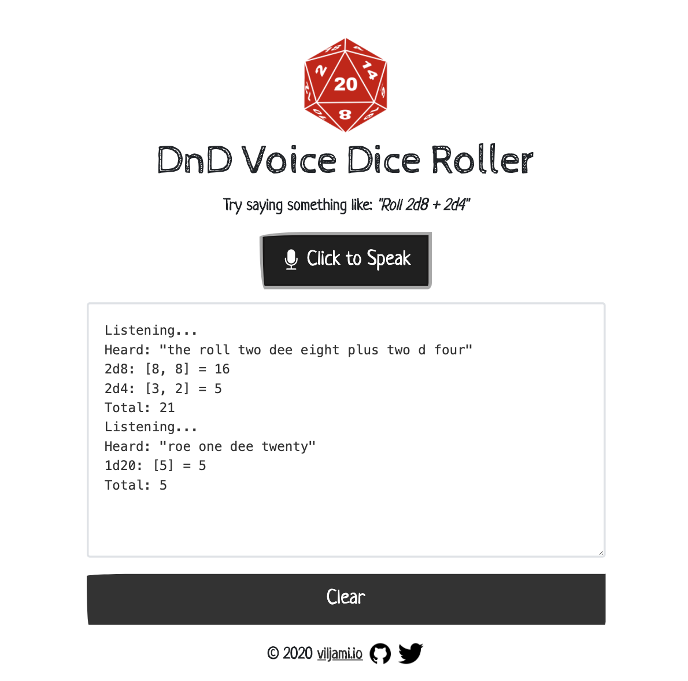

# DnD Voice Dice Roller
[](https://github.com/anttiviljami/openapicmd/blob/master/LICENSE)

[](https://buymeacoff.ee/anttiviljami)

A Voice-Controlled App to roll role-playing dice. Because why not.

Built with [Speechly](https://github.com/speechly/browser-client)

[Screenshot](#screenshot)

## Development

```bash
npm install
npm run dev # running in http://localhost:5000
```

## Production build

To create an optimised version of the app:

```bash
npm run build
```

You can run the newly built app with `npm run start`. This uses [sirv](https://github.com/lukeed/sirv), which is included in your package.json's `dependencies` so that the app will work when you deploy to platforms like [Heroku](https://heroku.com).

## Screenshot


